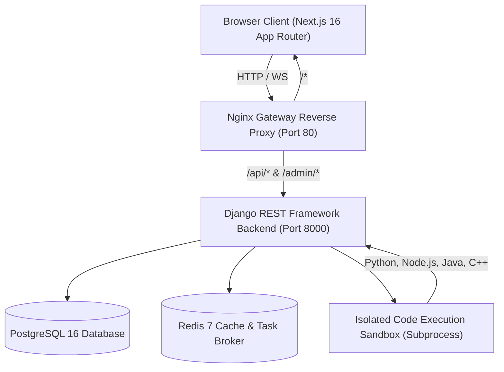

# AlgoForge — Full-Stack DSA Learning, Visualization & Practice Platform

[](https://www.djangoproject.com/)
[](https://nextjs.org/)
[](https://www.typescriptlang.org/)
[](https://tailwindcss.com/)
[](#automated-testing)

**AlgoForge** is an enterprise-grade Data Structures and Algorithms learning ecosystem that combines structured courses, interactive algorithmic timeline visualizations, an online code compiler sandbox, automated test-case evaluation, gamified progress tracking, a 7-tier DAG roadmap, global leaderboards, and intelligence analytics.

---

## Architecture Overview



### Modular Backend App Structure

| App Module | Responsibility | Key Endpoints |
|---|---|---|
| `apps.accounts` | UUID User authentication & Google OAuth2 verification | `/api/v1/auth/register/`, `login/`, `google/`, `me/` |
| `apps.courses` | Data-driven courses, modules, block-based lessons | `/api/v1/courses/`, `lessons/<slug>/`, `complete/` |
| `apps.algorithms` | Algorithm metadata, complexities, and pseudocode | `/api/v1/algorithms/`, `/<slug>/` |
| `apps.problems` | Problem repository, multi-language starter templates, hidden test cases | `/api/v1/problems/`, `tags/`, `/<slug>/` |
| `apps.compiler` | Isolated multi-runtime execution engine (timeouts & limits) | `/api/v1/compiler/execute/`, `languages/` |
| `apps.submissions` | Test-case evaluator, verdict engine, XP & streak awards | `/api/v1/submissions/`, `/<id>/` |
| `apps.progress` | Dashboard metrics, 365-day heatmap, leaderboard, daily goals | `/api/v1/progress/dashboard/`, `heatmap/`, `leaderboard/`, `stats/` |
| `apps.achievements` | Milestone criteria evaluator & bonus XP unlocking | `/api/v1/achievements/`, `check/` |
| `apps.roadmaps` | 7-tier DAG topic graph with prerequisite progression | `/api/v1/roadmaps/`, `/<slug>/`, `nodes/<slug>/progress/` |
| `apps.analytics` | Platform intelligence, language share, accuracy benchmarks | `/api/v1/analytics/platform/`, `user/` |

---

## Key Platform Features

### 1. Interactive Algorithm Visualizer Lab
- **Step-by-step Execution Engine**: Pure TypeScript step generator producing immutable visual timelines (`compare`, `swap`, `highlight`, `visit`, `modify`, `partition`, `found`, `not-found`, `complete`).
- **Control Bar**: Play/pause, step backward, step forward, variable speed slider (0.5x to 4x), scrub bar, and dataset randomizer.
- **Implemented Suite**:
  - **Searching**: Binary Search, Linear Search
  - **Sorting**: Bubble Sort, Selection Sort, Insertion Sort, Merge Sort, Quick Sort
  - **Arrays**: Two-Pointer Partitioning, Kadane's Maximum Subarray

### 2. Online Compiler & Code Studio
- **Monaco Editor Integration**: Dark IDE theme with line numbering, bracket colorization, and multi-language switcher.
- **Multi-Runtime Execution**: Native execution in Python 3, Node.js (JavaScript), Java JDK 17, and C++ (GCC).
- **Execution Sandbox**: Subprocess process isolation with millisecond timing, memory tracking, standard input piping, and strict CPU timeout limits (`Time Limit Exceeded`).
- **Automated Judge**: Tests submissions against public and hidden test cases, reporting verdicts (`Accepted`, `Wrong Answer`, `Time Limit Exceeded`, `Runtime Error`, `Compilation Error`).

### 3. Gamification & Motivation Engine
- **XP & Levels**: Automatic XP calculation and dynamic leveling (`Novice` to `Grandmaster`).
- **Streak Tracking**: Continuous practice streak tracking with longest streak recording and daily goals.
- **Achievement Badges**: 10 unlockable platform achievements with celebratory confetti and bonus XP rewards.
- **Global Leaderboard**: Top 3 Hall of Fame podium (Gold, Silver, Bronze) and dynamic ranking for all registered engineers.

### 4. 7-Tier DAG Learning Roadmap
- **Curriculum Stages**: Foundations, Core Sequences, Search & Sort, Linear Structures, Hierarchical Trees, Graphs, and Dynamic Programming.
- **Prerequisite Enforcement**: Ancestor nodes must be completed before dependent nodes unlock.
- **Deep Linking**: Direct navigation to theory lessons and targeted problem sets.

### 5. Platform Intelligence & Heatmap
- **Recharts Analytics**: 14-day submission throughput, language popularity distribution, and weekly study time.
- **365-Day Activity Grid**: GitHub-style contribution heatmap reflecting daily coding activity.

---

## Quickstart Guide

### Option A: Local Development

#### Prerequisites
- Python 3.12+
- Node.js 20+
- PostgreSQL or SQLite (SQLite used by default for local development)

#### 1. Backend Setup
```powershell
# Navigate to backend directory
cd backend

# Create and activate virtual environment
python -m venv venv
.\venv\Scripts\activate   # On Windows
# source venv/bin/activate # On macOS/Linux

# Install dependencies
pip install -r requirements.txt

# Run migrations
python manage.py migrate

# Seed all curriculum datasets (courses, problems, achievements, roadmaps)
python scripts/seed_all.py

# Start Django development server
python manage.py runserver 0.0.0.0:8000
```

#### 2. Frontend Setup
```powershell
# Open a new terminal and navigate to frontend directory
cd frontend

# Install dependencies
npm install

# Start Next.js development server
npm run dev
```

Visit **`http://localhost:3000`** in your browser.

---

### Option B: Docker Compose Production Deployment

Launch the complete containerized stack (Postgres 16, Redis 7, Django Gunicorn Backend, Next.js Frontend, Nginx Gateway):

```powershell
# In project root
docker compose up -d --build
```

- Application: **`http://localhost`**
- API Health Check: **`http://localhost/api/v1/health/`**
- Django Admin Portal: **`http://localhost/admin/`**

---

## Automated Testing

AlgoForge includes a complete automated test suite covering all 10 modular applications:

```powershell
cd backend
python manage.py test apps.accounts apps.progress apps.courses apps.algorithms apps.problems apps.compiler apps.submissions apps.achievements apps.roadmaps apps.analytics
```

**Test Suite Results**:
```
Ran 49 tests in 44.268s
OK (49 tests, 100% pass rate)
```

To build and validate the frontend production bundle:
```powershell
cd frontend
npm run build
```

---

## License

Built with ❤️ for algorithmic engineers and computer science learners.
Distributed under the MIT License.
